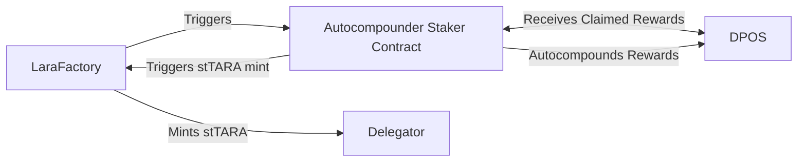
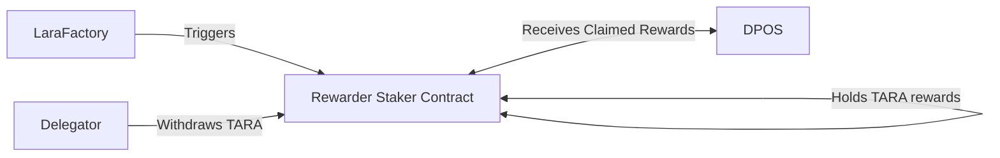
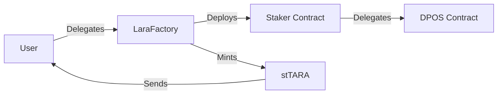
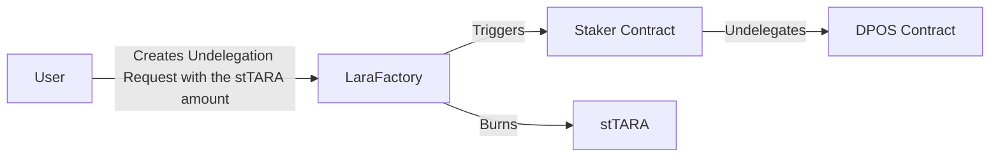
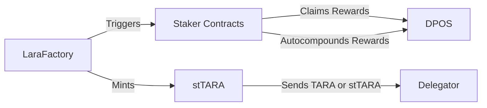

# EVM-based Liquid Staking Protocol Specification

- What to do when stTARA is transferred to another address?
- Look at OpenZeppelin pool implementation to define the reward tracking.

The protocol consists of the following smart contracts:

- [DPOS](#dpos)
- [ERC-20 Governance Token - Lara](#erc-20-governance-token---lara)
- [stTARA](#sttara)
- [LaraFactory](#larafactory)
- [Staker contract](#staker-contract)

## ERC-20 Governance Token - Lara

Lara is an ERC-20 governance token used within the protocol. It enables token holders to vote on various aspects of the protocol, including the protocol commission, reward distribution, autocompound epoch length, and more. The exact team allocation percentages are yet to be determined.

## ERC-20 Staking Token - stTARA

The stTARA token is a representation of the TARA token that is locked and staked within the protocol. It allows users to participate in liquid staking while still maintaining ownership of their TARA tokens. The stTARA token is minted when users delegate their TARA tokens to the protocol and can be redeemed for the equivalent amount of TARA tokens when users decide to undelegate.

## Smart Contract Architecture Building Blocks

## Staker contract

The Staker contract is a crucial component of the liquid staking protocol. It represents the staking relationship and is implemented by a proxy to the protocol DPOS. This is needed to ease the process of reward tracking as this way the individual rewards are calculated on protocol level. There are two types of Staker contracts: Autocompounder and Rewarder.

### Autocompounder Staker Contract

The Autocompounder Staker contract is responsible for automatically compounding the claimed rewards. Here's how it works:

- When the LaraFactory contract triggers the reward claim process, the Autocompounder Staker contract receives the claimed rewards.
- The Autocompounder Staker contract then automatically compounds the rewards by reinvesting them back into the staking pool. This process helps to maximize the overall staking rewards for the delegator.
- The compounded rewards are reflected in the delegator's staked balance, increasing the potential future rewards.

### Rewarder Staker Contract

The Rewarder Staker contract focuses solely on claiming rewards without automatically compounding them. Here's how it operates:

- When the LaraFactory contract triggers the reward claim process, the Rewarder Staker contract receives the claimed rewards.
- Unlike the Autocompounder Staker contract, the Rewarder Staker contract does not automatically reinvest the rewards. Instead, it holds the rewards in the contract balance, ready for the delegator to manually withdraw them.
- The delegator can choose the optimal time to withdraw the rewards, considering factors such as gas fees, market conditions, or personal preferences.

### LaraFactory

The LaraFactory contract serves as the central building block of the protocol. Its primary function is to deploy and manage Staker contracts for each staking user. Here's how it works:

- When a unique address delegates for the first time, the LaraFactory contract deploys a Staker contract specifically for that user. This Staker contract maps the delegations of the user and has a factory-only access modifier. Additionally, the LaraFactory contract mints an equivalent amount of stTARA tokens for the delegated TARA tokens.
- When a user delegates, the LaraFactory contract checks if a Staker contract has already been deployed for that user. If not, it deploys a new Staker contract. The deployed contract then calls the protocol-level DPOS contract and delegates on behalf of the user. The LaraFactory contract also mints the corresponding amount of stTARA tokens for the delegated TARA tokens.
- At the end of each reward epoch, the LaraFactory contract triggers reward claims for all managed Staker contracts. It also autocompounds the claimed rewards.
- When a user creates an undelegation request, the LaraFactory contract triggers the corresponding Staker contract to undelegate from the protocol DPOS contract. The undelegated funds become claimable after approximately 30 days, and the equivalent amount of stTARA tokens is burned instantly.

**Note**: Please note that the above description provides a high-level overview of the LaraFactory contract's functionality. For more detailed information, please refer to the smart contract code.

#### Delegation Process

#### Undelegation Process

#### Reward Claim and Autocompound Process

